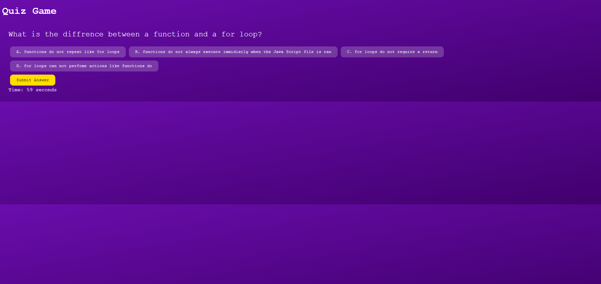

# Quiz-Code
A short multiple choice answer quiz on some coding facts.

## Table of Contents
[Description](#description)
[Usage](#usage)
[Features](#features)
[Credits](#credits)
[Lincences](#licences)

## Description
This is a simple short form quiz to practice the skills learned so far in the coding bootcamp class. Provides simplae multiple choice answer questions while being timed. Scores are then saved to the console with user inputed intitials. A look at the pre-launch version: 

The full launch: https://masonmanshark4.github.io/Quiz-Code/
## Usage
This is a good practice for both knowledge and skill. It serves as both a good study material as well as a goood way to practice various Java Script properties.

## Features
There are no third party Features need to be downloaded 

## Credits
Goes to Mr. Ragheed and Torres for helping me learn the skills needed to make the project

## Licences
There are no affiliated licences
